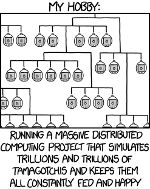
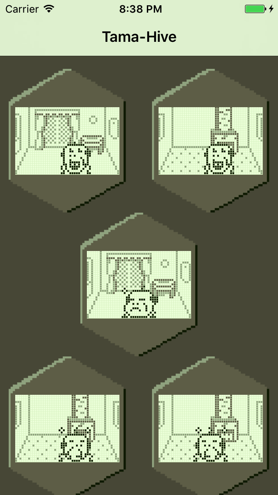

# Tamatrix for iOS/watchOS/tvOS

The singularity happened, but not to us. Standing on the shoulders of the awesome [Tamatrix project by Jeroen Domburg (Sprite_tm)](http://spritesmods.com/?art=tamasingularity), this project is an extension of the original work to support viewing hives and running Tamagotchi emulators on iOS, watchOS, and tvOS.

## Tama-Hive

Tama-Hive connects to a Tamatrix web server and provides a viewer of all of the actively-connected Tamagotchi in the hive. You can change the server URL in the Settings app.

## Tama-Emu

Tama-Emu runs an instance of the Tamatrix emulator on your device, allowing you to watch and interact with the virtual pet. You can enable the "benevolent AI" in the Settings app to take over the care and feeding of your Tamagotchi.

## License

This source code is [BSD licensed](./LICENSE) (c) 2017 Christopher Bonhage

The original emulator source code is BEER-WARE licensed (c) 2015 Jeroen Domburg and is [available on the original author's git server](http://git.spritesserver.nl/tamatrix.git/).

Tamagotchi is a trademark of Bandai. This project is not affiliated or endorsed by Bandai in any way.

## Thanks

This project would not have been possible without the brilliant work of [Natalie Sylvanovich](http://natashenka.ca/about/) and [Jeroen Domburg (Sprite_tm)](http://spritesmods.com/?art=about).
